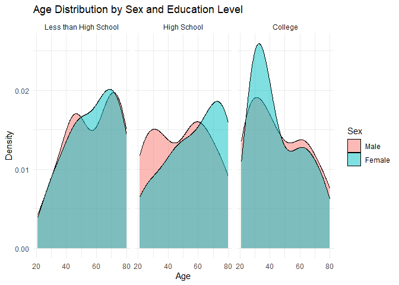
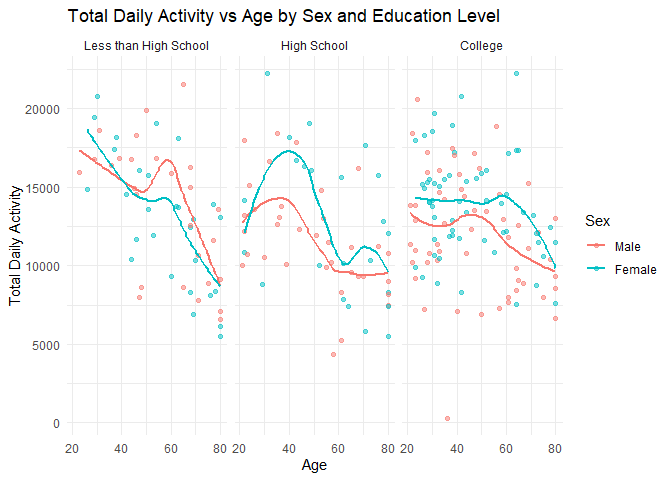
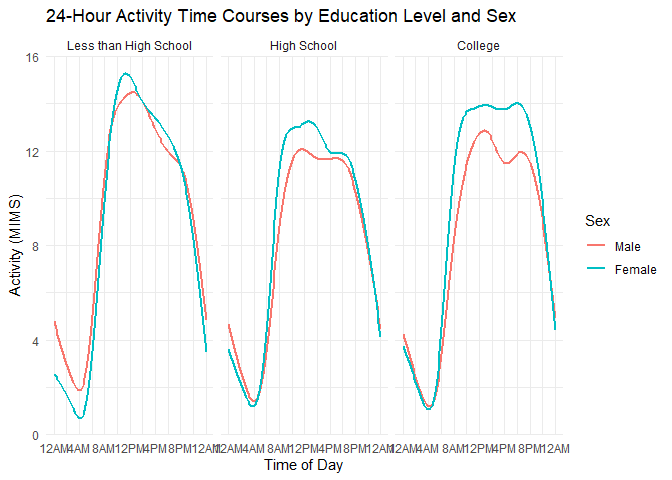

p8105_hw2_xs2569
================
Xun Sun
2024-10-06

# Problem 2 - NHANES Accelerometer Data

``` r
# Load the necessary libraries
library(tidyverse)
library(readxl)
```

``` r
# Read and clean the demographic dataset
demographics_df <- 
  read_csv("./data/nhanes_covar.csv",skip = 4) |> 
  janitor::clean_names() |>
  filter(age >= 21, !is.na(education), !is.na(sex)) # Exclude participants under 21 and those with missing data
```

    ## Rows: 250 Columns: 5
    ## ── Column specification ────────────────────────────────────────────────────────
    ## Delimiter: ","
    ## dbl (5): SEQN, sex, age, BMI, education
    ## 
    ## ℹ Use `spec()` to retrieve the full column specification for this data.
    ## ℹ Specify the column types or set `show_col_types = FALSE` to quiet this message.

``` r
View(demographics_df)
```

``` r
# Read and clean the accelerometer dataset
accelerometer_df <- 
  read_csv("./data/nhanes_accel.csv") |>
  janitor::clean_names()
```

    ## Rows: 250 Columns: 1441
    ## ── Column specification ────────────────────────────────────────────────────────
    ## Delimiter: ","
    ## dbl (1441): SEQN, min1, min2, min3, min4, min5, min6, min7, min8, min9, min1...
    ## 
    ## ℹ Use `spec()` to retrieve the full column specification for this data.
    ## ℹ Specify the column types or set `show_col_types = FALSE` to quiet this message.

``` r
view(accelerometer_df)
```

``` r
# Join the demographic and accelerometer datasets by participant ID
final_data <- 
  left_join(accelerometer_df, demographics_df, by = "seqn") |>
  drop_na()

# View the cleaned final dataset
view(final_data)
str(final_data[, (ncol(final_data)-9):ncol(final_data)])
```

    ## tibble [228 × 10] (S3: tbl_df/tbl/data.frame)
    ##  $ min1435  : num [1:228] 0.972 3.892 5.545 4.272 10.34 ...
    ##  $ min1436  : num [1:228] 0.903 8.829 7.993 6.36 7.25 ...
    ##  $ min1437  : num [1:228] 0.101 5.72 3.267 2.968 7.362 ...
    ##  $ min1438  : num [1:228] 1.4 8.25 4.68 3.81 7.49 ...
    ##  $ min1439  : num [1:228] 1.38 3.03 7.95 4.66 7.65 ...
    ##  $ min1440  : num [1:228] 1.53 4.46 4.51 6.4 8.08 ...
    ##  $ sex      : num [1:228] 1 2 1 1 1 1 1 1 2 1 ...
    ##  $ age      : num [1:228] 22 44 21 80 51 80 35 26 30 57 ...
    ##  $ bmi      : num [1:228] 23.3 23.2 20.1 33.9 20.1 28.5 27.9 22.1 22.4 28 ...
    ##  $ education: num [1:228] 2 3 2 3 2 2 3 2 3 3 ...

``` r
final_data <- final_data |>
  mutate(
    education = ordered(education, levels = 1:3, labels = c("Less than High School", "High School", "College")),
    sex = factor(sex, levels = c(1, 2), labels = c("Male", "Female"))
  )
view(final_data)
```

# Create a table of men and women in each education category

``` r
education_sex_table <- final_data |>
  group_by(education, sex) |>
  summarise(count = n(), .groups = "drop") |>
  pivot_wider(names_from = sex, values_from = count) |>
  mutate(Total = Male + Female)
view(education_sex_table)
# Display the table
knitr::kable(education_sex_table, caption = "Number of Men and Women in Each Education Category")
```

| education             | Male | Female | Total |
|:----------------------|-----:|-------:|------:|
| Less than High School |   27 |     28 |    55 |
| High School           |   35 |     23 |    58 |
| College               |   56 |     59 |   115 |

Number of Men and Women in Each Education Category

``` r
# Visualize age distributions for men and women in each education category
ggplot(final_data, aes(x = age, fill = sex)) +
  geom_density(alpha = 0.5) +
  facet_wrap(~ education) +
  labs(title = "Age Distribution by Sex and Education Level",
       x = "Age", y = "Density",
       fill = "Sex") +
  theme_minimal()
```

<!-- -->

``` r
# Calculate total daily activity for each participant
final_data <- final_data |>
  mutate(total_activity = rowSums(select(final_data, starts_with("min"))))

# Plot total activity against age, comparing men and women across education levels
ggplot(final_data, aes(x = age, y = total_activity, color = sex)) +
  geom_point(alpha = 0.5) +
  geom_smooth(method = "loess", se = FALSE) +
  facet_wrap(~ education) +
  labs(title = "Total Daily Activity vs Age by Sex and Education Level",
       x = "Age", y = "Total Daily Activity",
       color = "Sex") +
  theme_minimal()
```

    ## `geom_smooth()` using formula = 'y ~ x'

<!-- -->

``` r
# Prepare data for 24-hour activity plot
activity_long <- final_data |>
  pivot_longer(cols = starts_with("min"), 
               names_to = "minute", 
               values_to = "activity") |>
  mutate(minute = as.numeric(str_remove(minute, "min")))

# Create 24-hour activity plot
ggplot(activity_long, aes(x = minute, y = activity, color = sex)) +
  geom_smooth(se = FALSE) +
  facet_wrap(~ education) +
  scale_x_continuous(breaks = seq(0, 1440, 240),
                     labels = c("12AM", "4AM", "8AM", "12PM", "4PM", "8PM", "12AM")) +
  labs(title = "24-Hour Activity Time Courses by Education Level and Sex",
       x = "Time of Day", y = "Activity (MIMS)",
       color = "Sex") +
  theme_minimal()
```

    ## `geom_smooth()` using method = 'gam' and formula = 'y ~ s(x, bs = "cs")'

<!-- -->
