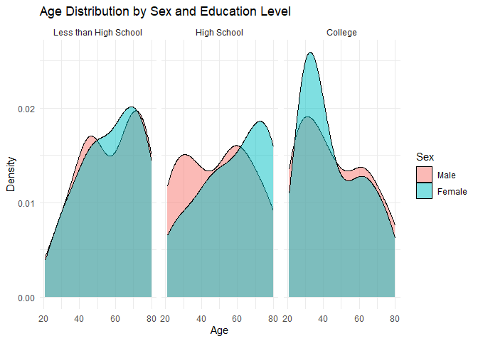
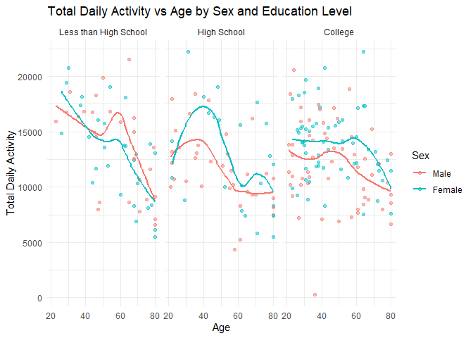
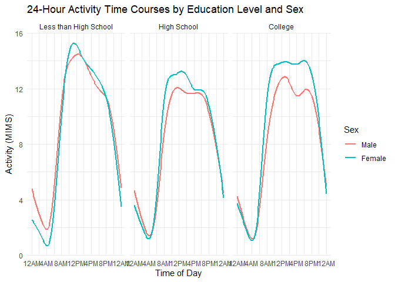
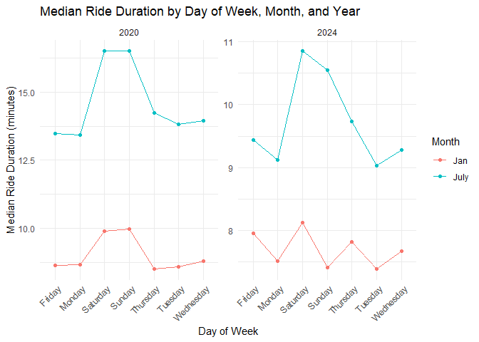
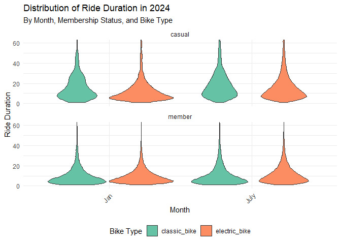
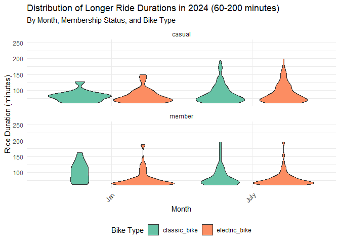

p8105_hw2_xs2569
================
Xun Sun
2024-10-06

# Problem 1 -

``` r
library(tidyverse)
```

    ## ── Attaching core tidyverse packages ──────────────────────── tidyverse 2.0.0 ──
    ## ✔ dplyr     1.1.4     ✔ readr     2.1.5
    ## ✔ forcats   1.0.0     ✔ stringr   1.5.1
    ## ✔ ggplot2   3.5.1     ✔ tibble    3.2.1
    ## ✔ lubridate 1.9.3     ✔ tidyr     1.3.1
    ## ✔ purrr     1.0.2     
    ## ── Conflicts ────────────────────────────────────────── tidyverse_conflicts() ──
    ## ✖ dplyr::filter() masks stats::filter()
    ## ✖ dplyr::lag()    masks stats::lag()
    ## ℹ Use the conflicted package (<http://conflicted.r-lib.org/>) to force all conflicts to become errors

``` r
library(p8105.datasets)
data("ny_noaa")
```

Missing data is a significant issue in this dataset. Here are the counts
of missing values for each variable:

- `id`: 0
- `date`: 0
- `prcp`: 145838
- `snow`: 381221
- `snwd`: 591786
- `tmax`: 1134358
- `tmin`: 1134420

# Problem 2 - NHANES Accelerometer Data

``` r
# Load the necessary libraries
library(readxl)
```

``` r
# Read and clean the demographic dataset
demographics_df <- 
  read_csv("./data/nhanes_covar.csv",skip = 4) |> 
  janitor::clean_names() |>
  filter(age >= 21, !is.na(education), !is.na(sex)) # Exclude participants under 21 and those with missing data
```

    ## Rows: 250 Columns: 5
    ## ── Column specification ────────────────────────────────────────────────────────
    ## Delimiter: ","
    ## dbl (5): SEQN, sex, age, BMI, education
    ## 
    ## ℹ Use `spec()` to retrieve the full column specification for this data.
    ## ℹ Specify the column types or set `show_col_types = FALSE` to quiet this message.

``` r
View(demographics_df)
```

``` r
# Read and clean the accelerometer dataset
accelerometer_df <- 
  read_csv("./data/nhanes_accel.csv") |>
  janitor::clean_names()
```

    ## Rows: 250 Columns: 1441
    ## ── Column specification ────────────────────────────────────────────────────────
    ## Delimiter: ","
    ## dbl (1441): SEQN, min1, min2, min3, min4, min5, min6, min7, min8, min9, min1...
    ## 
    ## ℹ Use `spec()` to retrieve the full column specification for this data.
    ## ℹ Specify the column types or set `show_col_types = FALSE` to quiet this message.

``` r
view(accelerometer_df)
```

``` r
# Join the demographic and accelerometer datasets by participant ID
final_data <- 
  left_join(accelerometer_df, demographics_df, by = "seqn") |>
  drop_na()

# View the cleaned final dataset
view(final_data)
str(final_data[, (ncol(final_data)-9):ncol(final_data)])
```

    ## tibble [228 × 10] (S3: tbl_df/tbl/data.frame)
    ##  $ min1435  : num [1:228] 0.972 3.892 5.545 4.272 10.34 ...
    ##  $ min1436  : num [1:228] 0.903 8.829 7.993 6.36 7.25 ...
    ##  $ min1437  : num [1:228] 0.101 5.72 3.267 2.968 7.362 ...
    ##  $ min1438  : num [1:228] 1.4 8.25 4.68 3.81 7.49 ...
    ##  $ min1439  : num [1:228] 1.38 3.03 7.95 4.66 7.65 ...
    ##  $ min1440  : num [1:228] 1.53 4.46 4.51 6.4 8.08 ...
    ##  $ sex      : num [1:228] 1 2 1 1 1 1 1 1 2 1 ...
    ##  $ age      : num [1:228] 22 44 21 80 51 80 35 26 30 57 ...
    ##  $ bmi      : num [1:228] 23.3 23.2 20.1 33.9 20.1 28.5 27.9 22.1 22.4 28 ...
    ##  $ education: num [1:228] 2 3 2 3 2 2 3 2 3 3 ...

``` r
final_data <- final_data |>
  mutate(
    education = ordered(education, levels = 1:3, labels = c("Less than High School", "High School", "College")),
    sex = factor(sex, levels = c(1, 2), labels = c("Male", "Female"))
  )
view(final_data)
```

# Create a table of men and women in each education category

``` r
education_sex_table <- final_data |>
  group_by(education, sex) |>
  summarise(count = n(), .groups = "drop") |>
  pivot_wider(names_from = sex, values_from = count) |>
  mutate(Total = Male + Female)
# view(education_sex_table)
# Display the table
knitr::kable(education_sex_table, caption = "Number of Men and Women in Each Education Category")
```

| education             | Male | Female | Total |
|:----------------------|-----:|-------:|------:|
| Less than High School |   27 |     28 |    55 |
| High School           |   35 |     23 |    58 |
| College               |   56 |     59 |   115 |

Number of Men and Women in Each Education Category

For education, there are 115 individuals in college group, while there
are 58 and 55 in high school and less than high school. For sex, in each
group, the numbers of individuals for male and female group are similar.

``` r
# Visualize age distributions for men and women in each education category
ggplot(final_data, aes(x = age, fill = sex)) +
  geom_density(alpha = 0.5) +
  facet_wrap(~ education) +
  labs(title = "Age Distribution by Sex and Education Level",
       x = "Age", y = "Density",
       fill = "Sex") +
  theme_minimal()
```

<!-- --> We
can see different distribution for male and female of age in the three
education groups. The six distributions are not symmetric and all the
three education groups of female on age are bimodal distribution.

``` r
# Calculate total daily activity for each participant
final_data <- final_data |>
  mutate(total_activity = rowSums(select(final_data, starts_with("min"))))

# Plot total activity against age, comparing men and women across education levels
ggplot(final_data, aes(x = age, y = total_activity, color = sex)) +
  geom_point(alpha = 0.5) +
  geom_smooth(method = "loess", se = FALSE) +
  facet_wrap(~ education) +
  labs(title = "Total Daily Activity vs Age by Sex and Education Level",
       x = "Age", y = "Total Daily Activity",
       color = "Sex") +
  theme_minimal()
```

    ## `geom_smooth()` using formula = 'y ~ x'

<!-- --> We
can observe that total daily activity generally increases with age at
first and then decreases. Regardless of gender, educational background,
or age, there are significant differences between individuals. In the
high school and college groups, the average activity level of females is
higher than that of males at any age. However, in the “less than high
school” group, females’ activity levels are initially lower than males
as they age but eventually surpass them.

``` r
# Prepare data for 24-hour activity plot
activity_long <- final_data |>
  pivot_longer(cols = starts_with("min"), 
               names_to = "minute", 
               values_to = "activity") |>
  mutate(minute = as.numeric(str_remove(minute, "min")))

# Create 24-hour activity plot
ggplot(activity_long, aes(x = minute, y = activity, color = sex)) +
  geom_smooth(se = FALSE) +
  facet_wrap(~ education) +
  scale_x_continuous(breaks = seq(0, 1440, 240),
                     labels = c("12AM", "4AM", "8AM", "12PM", "4PM", "8PM", "12AM")) +
  labs(title = "24-Hour Activity Time Courses by Education Level and Sex",
       x = "Time of Day", y = "Activity (MIMS)",
       color = "Sex") +
  theme_minimal()
```

    ## `geom_smooth()` using method = 'gam' and formula = 'y ~ s(x, bs = "cs")'

<!-- --> We
can see similar patterns between male and female in the three education
groups. The lowest MIMS is arround 4AM, the highest MIMS various between
groups arround 8am to 8pm in a day.

# Problem 3 - Citi Bike Data

``` r
# Import necessary libraries
library(tidyverse)

# Define function to process files
process_file <- function(file_path) {
  # Extract month and year from file name
  file_name <- basename(file_path)
  month <- str_extract(file_name, "Jan|July")
  year <- str_extract(file_name, "\\d{4}")
  
  read_csv(file_path, na=c("","NA","NULL",".")) |>
    janitor::clean_names() |>
    mutate(
      ride_id = as.character(ride_id),
      rideable_type = as.factor(rideable_type),
      start_station_name = as.character(start_station_name),
      end_station_name = as.character(end_station_name),
      member_casual = as.factor(member_casual),
      month = month,
      year = as.numeric(year)
    ) 
}

# Read all CSV files
file_paths <- c(
  "./data/July 2024 Citi.csv",
  "./data/Jan 2024 Citi.csv",
  "./data/July 2020 Citi.csv",
  "./data/Jan 2020 Citi.csv"
)
bike_data <- map_df(file_paths, process_file)
```

    ## Rows: 47156 Columns: 7
    ## ── Column specification ────────────────────────────────────────────────────────
    ## Delimiter: ","
    ## chr (6): ride_id, rideable_type, weekdays, start_station_name, end_station_n...
    ## dbl (1): duration
    ## 
    ## ℹ Use `spec()` to retrieve the full column specification for this data.
    ## ℹ Specify the column types or set `show_col_types = FALSE` to quiet this message.
    ## Rows: 18861 Columns: 7
    ## ── Column specification ────────────────────────────────────────────────────────
    ## Delimiter: ","
    ## chr (6): ride_id, rideable_type, weekdays, start_station_name, end_station_n...
    ## dbl (1): duration
    ## 
    ## ℹ Use `spec()` to retrieve the full column specification for this data.
    ## ℹ Specify the column types or set `show_col_types = FALSE` to quiet this message.
    ## Rows: 21048 Columns: 7
    ## ── Column specification ────────────────────────────────────────────────────────
    ## Delimiter: ","
    ## chr (6): ride_id, rideable_type, weekdays, start_station_name, end_station_n...
    ## dbl (1): duration
    ## 
    ## ℹ Use `spec()` to retrieve the full column specification for this data.
    ## ℹ Specify the column types or set `show_col_types = FALSE` to quiet this message.
    ## Rows: 12420 Columns: 7
    ## ── Column specification ────────────────────────────────────────────────────────
    ## Delimiter: ","
    ## chr (6): ride_id, rideable_type, weekdays, start_station_name, end_station_n...
    ## dbl (1): duration
    ## 
    ## ℹ Use `spec()` to retrieve the full column specification for this data.
    ## ℹ Specify the column types or set `show_col_types = FALSE` to quiet this message.

``` r
view(bike_data)
```

``` r
ride_summary <- bike_data |>
  group_by(year, month, member_casual) |>
  summarise(total_rides = n(), .groups = 'drop') |>
  pivot_wider(names_from = member_casual, values_from = total_rides, values_fill = 0) |>
  mutate(total = casual + member) |>
  arrange(year, month) 
  

# Display the table using knitr::kable for better readability
knitr::kable(ride_summary, 
             col.names = c("Year", "Month", "Casual Riders", "Members", "Total Rides"),
             caption = "Total Number of Rides by Year, Month, and Rider Type",
             format = "html",
             digits = 0)
```

<table>
<caption>
Total Number of Rides by Year, Month, and Rider Type
</caption>
<thead>
<tr>
<th style="text-align:right;">
Year
</th>
<th style="text-align:left;">
Month
</th>
<th style="text-align:right;">
Casual Riders
</th>
<th style="text-align:right;">
Members
</th>
<th style="text-align:right;">
Total Rides
</th>
</tr>
</thead>
<tbody>
<tr>
<td style="text-align:right;">
2020
</td>
<td style="text-align:left;">
Jan
</td>
<td style="text-align:right;">
984
</td>
<td style="text-align:right;">
11436
</td>
<td style="text-align:right;">
12420
</td>
</tr>
<tr>
<td style="text-align:right;">
2020
</td>
<td style="text-align:left;">
July
</td>
<td style="text-align:right;">
5637
</td>
<td style="text-align:right;">
15411
</td>
<td style="text-align:right;">
21048
</td>
</tr>
<tr>
<td style="text-align:right;">
2024
</td>
<td style="text-align:left;">
Jan
</td>
<td style="text-align:right;">
2108
</td>
<td style="text-align:right;">
16753
</td>
<td style="text-align:right;">
18861
</td>
</tr>
<tr>
<td style="text-align:right;">
2024
</td>
<td style="text-align:left;">
July
</td>
<td style="text-align:right;">
10894
</td>
<td style="text-align:right;">
36262
</td>
<td style="text-align:right;">
47156
</td>
</tr>
</tbody>
</table>

``` r
# Create a table of the 5 most popular starting stations for July 2024
popular_stations_july_2024 <- bike_data |>
  filter(year == 2024, month == "July") |>
  group_by(start_station_name) |>
  summarise(number_of_rides = n()) |>
  arrange(desc(number_of_rides)) |>
  slice_head(n = 5)

# Display the table using knitr::kable for better readability
knitr::kable(popular_stations_july_2024,
             col.names = c("Starting Station", "Number of Rides"),
             caption = "Top 5 Most Popular Starting Stations in July 2024",
             format = "html",
             digits = 0)
```

<table>
<caption>
Top 5 Most Popular Starting Stations in July 2024
</caption>
<thead>
<tr>
<th style="text-align:left;">
Starting Station
</th>
<th style="text-align:right;">
Number of Rides
</th>
</tr>
</thead>
<tbody>
<tr>
<td style="text-align:left;">
Pier 61 at Chelsea Piers
</td>
<td style="text-align:right;">
163
</td>
</tr>
<tr>
<td style="text-align:left;">
University Pl & E 14 St
</td>
<td style="text-align:right;">
155
</td>
</tr>
<tr>
<td style="text-align:left;">
W 21 St & 6 Ave
</td>
<td style="text-align:right;">
152
</td>
</tr>
<tr>
<td style="text-align:left;">
West St & Chambers St
</td>
<td style="text-align:right;">
150
</td>
</tr>
<tr>
<td style="text-align:left;">
W 31 St & 7 Ave
</td>
<td style="text-align:right;">
146
</td>
</tr>
</tbody>
</table>

``` r
# Calculate median ride duration by day of week, month, and year
ride_duration_summary <- bike_data |>
  group_by(year, month, weekdays) |>
  summarise(median_duration = median(duration, na.rm = TRUE), .groups = 'drop')

# Create the plot
ggplot(ride_duration_summary, aes(x = weekdays, y = median_duration, color = month)) +
  geom_point() +
  geom_line(aes(group = month)) +
  facet_wrap(~ year, scales = "free_y", ncol = 2) +
  labs(
    title = "Median Ride Duration by Day of Week, Month, and Year",
    x = "Day of Week",
    y = "Median Ride Duration (minutes)",
    color = "Month"
  ) +
  theme_minimal() +
  theme(axis.text.x = element_text(angle = 45, hjust = 1))
```

<!-- -->

``` r
# Filter data for 2024 and create a new column for ride duration in minutes
bike_data_2024 <- bike_data |>
  filter(year == 2024) |>
  mutate(duration_minutes = duration)

# Create the plot
ggplot(bike_data_2024, aes(x = month, y = duration_minutes, fill = rideable_type)) +
  geom_violin() +  # Remove outliers for better visibility
  facet_wrap(~ member_casual, ncol = 1) +
  coord_cartesian(ylim = c(0, 60)) +  # Limit y-axis to 60 minutes for better focus
  labs(
    title = "Distribution of Ride Duration in 2024",
    subtitle = "By Month, Membership Status, and Bike Type",
    x = "Month",
    y = "Ride Duration",
    fill = "Bike Type"
  ) +
  theme_minimal() +
  theme(
    axis.text.x = element_text(angle = 45, hjust = 1),
    legend.position = "bottom"
  ) +
  scale_fill_brewer(palette = "Set2")
```

<!-- -->

``` r
# Add a brief explanation
cat("This figure shows the distribution of ride durations in 2024, broken down by month, membership status, and bike type. The box plots represent the interquartile range, with the median shown as a line inside each box. The y-axis is limited to 60 minutes to focus on the most common ride durations and improve readability.")
```

    ## This figure shows the distribution of ride durations in 2024, broken down by month, membership status, and bike type. The box plots represent the interquartile range, with the median shown as a line inside each box. The y-axis is limited to 60 minutes to focus on the most common ride durations and improve readability.

``` r
# Create a new plot focusing on longer ride durations (60-200 minutes)
ggplot(bike_data_2024 |> filter(duration_minutes >= 60 & duration_minutes <= 200), 
       aes(x = month, y = duration_minutes, fill = rideable_type)) +
  geom_violin() +
  facet_wrap(~ member_casual, ncol = 1) +
  coord_cartesian(ylim = c(60, 250)) +
  labs(
    title = "Distribution of Longer Ride Durations in 2024 (60-200 minutes)",
    subtitle = "By Month, Membership Status, and Bike Type",
    x = "Month",
    y = "Ride Duration (minutes)",
    fill = "Bike Type"
  ) +
  theme_minimal() +
  theme(
    axis.text.x = element_text(angle = 45, hjust = 1),
    legend.position = "bottom"
  ) +
  scale_fill_brewer(palette = "Set2")
```

<!-- -->

``` r
# Add an explanation for the new plot
cat("This second figure focuses on longer ride durations, ranging from 60 to 200 minutes, in 2024. It provides insight into the distribution of extended rides, which may represent different usage patterns or user behaviors compared to shorter trips. The violin plots show the density of ride durations within this range, allowing for comparison across months, membership types, and bike types for these longer journeys.")
```

    ## This second figure focuses on longer ride durations, ranging from 60 to 200 minutes, in 2024. It provides insight into the distribution of extended rides, which may represent different usage patterns or user behaviors compared to shorter trips. The violin plots show the density of ride durations within this range, allowing for comparison across months, membership types, and bike types for these longer journeys.
